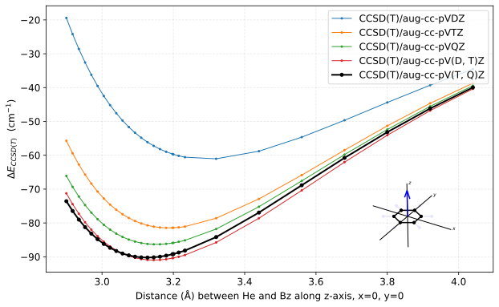
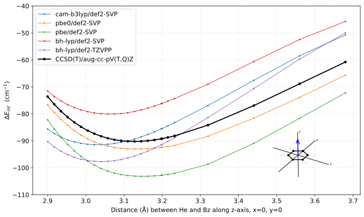
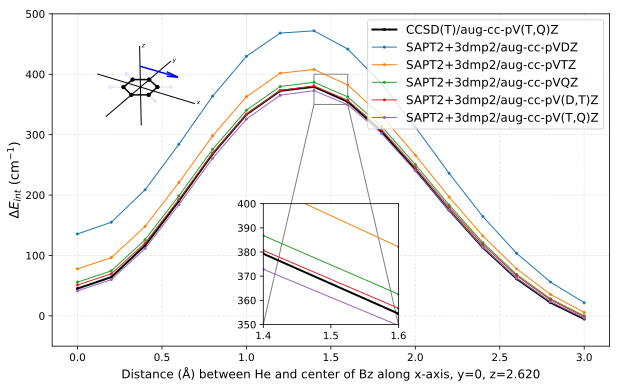
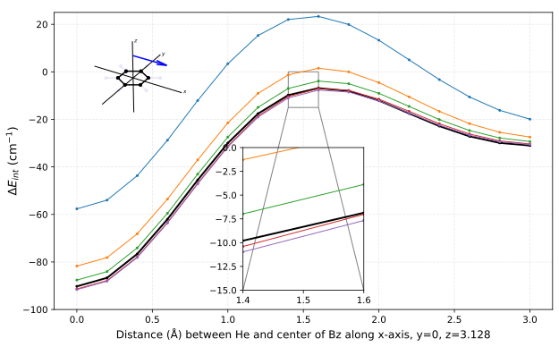
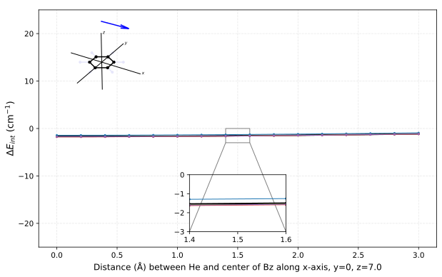
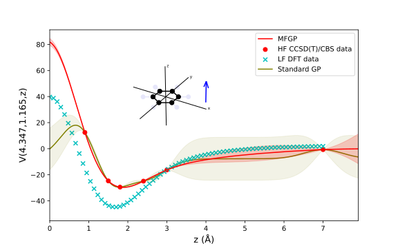
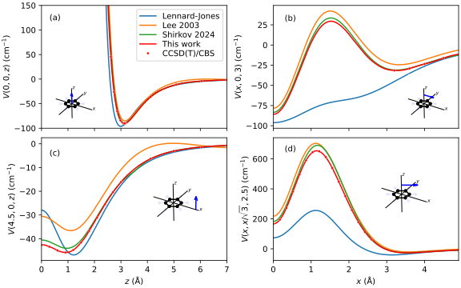
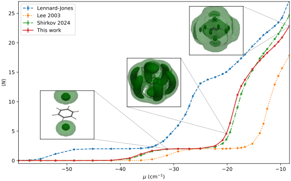
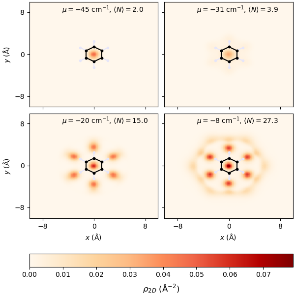

# Accurate Helium-Benzene Potential: from CCSD(T) to Gaussian Process Regression

Shahzad Akram, Sutirtha Paul, Collin Kovacs, Vasileios Maroulas, Adrian Del Maestro and Konstantinos D. Vogiatzis

[arXiv:XXXX.YYYYY](https://arxiv.org/abs/XXXX.YYYYY)

### Abstract
The accurate modeling of non-covalent interactions between helium and graphitic materials is important for understanding quantum phenomena in reduced dimensions, with the helium-benzene complex serving as the fundamental prototype. However, creating a quantitatively reliable potential energy surface (PES) for this weakly bound system remains a significant computational challenge. In this work, we present a comprehensive, multi-level investigation of the He-Bz interaction, establishing benchmark energies using high-level coupled-cluster singles-and-doubles with perturbative triples (CCSD(T)) methods extrapolated to the complete basis set limit and assessing higher-order (CCSDT(Q)) contributions. We use symmetry-adapted perturbation theory (SAPT) to benchmark it against CCSD(T) and to decompose the interaction into its physical components—confirming it is dominated by a balance between dispersion and exchange-repulsion. A continuous, three-dimensional PES is constructed from discrete ab initio points using multifidelity Gaussian process regression that combines density functional theory results with sparse coupled-cluster energies. The result is a highly accurate PES with sub-cm−1 accuracy that obeys physical laws. This new PES is applied to path integral Monte Carlo (PIMC) simulations to study the solvation of 4He atoms on benzene at low temperatures. Our PIMC results reveal qualitatively different solvation behavior, particularly in the filling of adsorption layers, when compared to simulations using commonly employed empirical Lennard-Jones potentials. This work provides a benchmark PES essential for accurate many-body simulations of helium on larger polycyclic aromatic hydrocarbons towards graphene.

### Description
This repository includes links, code, scripts, and data to generate the figures in a paper.

### Requirements
The QMC data was generated with quantum Monte Carlo using our [open source path integral software](https://code.delmaestro.org) also available on [github](https://github.com/delmaestrogroup/pimc). The potential for the QMC data is available as python package on [github](https://github.com/paulsphys/HeBz). Processed data is included in the [data]([https://github.com/DelMaestroGroup/papers-code-template/tree/main/data](https://github.com/DelMaestroGroup/papers-code-HeBenzene/tree/main/data)) directory and the full raw simulation data set is available online at 

1. A minimal environment to execute these notebooks can be installed via `conda env create -f environment.yml`
2. The [HeBz library](https://github.com/paulsphys/HeBz) is needed for plots and can be installed with `pip install git+https://github.com/paulsphys/HeBz.git`

### Support
The creation of these materials was supported by the The University of Tennessee Materials Research Science & Engineering Center — The Center for Advanced Materials and Manufacturing which is in turn supported by the National Science Foundation under DMR No. 2309083. 

### Figures

#### Figure 01: CCSD(T) results

#### Figure 02: DFT Benchmark plots

#### Figure 03a: SAPT-1

#### Figure 03b: SAPT-2

#### Figure 03c: SAPT-3

#### Figure 04: SAPT Decomposition

#### Figure 05: Multi-Fidelity demo

#### Figure 06: Comparison of Error for the two models

#### Figure 07: Potential Energy 2D

#### Figure 08: Comparison of various potentials

#### Figure 09: N vs $\mu$ comparison

#### Figure 10a: Planar Density LJ

#### Figure 10b: Planar Density GP

This figure is released under [CC BY-SA 4.0](https://creativecommons.org/licenses/by-sa/4.0/) and can be freely copied, redistributed and remixed.

