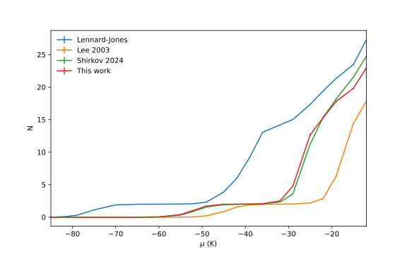

# Accurate Helium-Benzene Potential: from CCSD(T) to Gaussian Process Regression

Shahzad Akram, Sutirtha Paul, Adrian Del Maestro and Konstantinos D. Vogiatzis

[arXiv:XXXX.YYYYY](https://arxiv.org/abs/XXXX.YYYYY)

### Abstract
The accurate modeling of non-covalent interactions between helium and graphitic
materials is important for understanding quantum phenomena in reduced di-
mensions, with the helium-benzene (He-Bz) complex serving as the fundamental
prototype. However, creating a quantitatively reliable potential energy surface
(PES) for this weakly bound system remains a significant computational chal-
lenge. In this work, we present a comprehensive, multi-level investigation of the
He-Bz interaction, establishing benchmark energies using high-level coupled-
cluster coupled-cluster singles-and-doubles with perturbative triples (CCSD(T))
methods extrapolated to the complete basis set (CBS) and assessing higher-
order (CCSDT(Q)) contributions. We use symmetry-adapted perturbation the-
ory (SAPT) to benchmark it against CCSD(T) and to decompose the inter-
action into its physical components—confirming it is dominated by a balance
between dispersion and exchange-repulsion. A continuous, three-dimensional
PES is then constructed from 2525 discrete ab initio points using Gaussian Pro-
cess (GP) regression. This new PES is applied in Path Integral Monte Carlo
(PIMC) simulations to study the adsorption of 4He atoms on benzene at low
temperatures. Our PIMC results reveal qualitatively different adsorption behav-
ior, particularly in the filling of adsorption layers, when compared to simulations
using commonly employed empirical Lennard-Jones potentials. This work pro-
vides a benchmark PES essential for accurate many-body simulations of helium
on larger polycyclic aromatic hydrocarbons and graphene.

### Description
This repository includes links, code, scripts, and data to generate the figures in a paper.

### Requirements
The data in this project was generated via ...  Processed data is included in the [data](https://github.com/DelMaestroGroup/papers-code-template/tree/main/data) directory and the full raw simulation data set is available online at 

1. A minimal environment to execute these notebooks can be installed via `pip install -r requirements.txt`
2. [Dependency Name](https://dependencelink)
3. ...

### Support
The creation of these materials was supported by the The University of Tennessee Materials Research Science & Engineering Center — The Center for Advanced Materials and Manufacturing which is in turn supported by the National Science Foundation under DMR No. 2309083. 

<!---->

### Figures

#### Figure 01: Multi-Fidelity demo

#### Figure 02: Comparison of Error for the two models

#### Figure 03: Comparison of various potentials

#### Figure 04: Potential Energy 2D

#### Figure 05: N vs $\mu$ comparison

#### Figure 06a: Planar Density LJ

#### Figure 06b: Planar Density GP

This figure is released under [CC BY-SA 4.0](https://creativecommons.org/licenses/by-sa/4.0/) and can be freely copied, redistributed and remixed.

